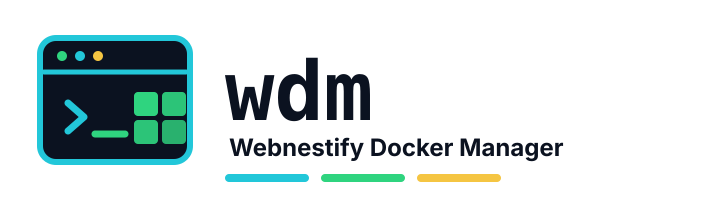

<p align="center">
  
</p>

# wdm — Webnestify Docker Manager

[](go.mod)
[](LICENSE)
[](https://github.com/wnstify/wdm/actions/workflows/test.yml)
[](https://codecov.io/gh/wnstify/wdm)
[](https://scorecard.dev/viewer/?uri=github.com/wnstify/wdm)
[](https://github.com/wnstify/wdm/releases)
[](https://webnestify.org/donate/)

`wdm` is a terminal application — a TUI and a CLI — for installing, updating, and checking a curated set of Docker Compose self-hosting templates, with safe defaults and minimal operational friction.

## Support this project

<table>
  <tr>
    <td width="180" align="center">
      <a href="https://webnestify.org/donate/">
        
      </a>
    </td>
    <td>
      <p><strong><code>wdm</code> is free and open source.</strong> If it saves you time, please support continued development by donating to <a href="https://webnestify.org/donate/">Webnestify Education</a>.</p>
      <p>Webnestify Education is a Slovak nonprofit that provides free cybersecurity education for schools, communities, families, seniors, and anyone who needs it. Donations go through a public transparent account, so supporters can see where the money goes.</p>
      <p><strong><a href="https://webnestify.org/donate/">Donate to Webnestify Education -&gt;</a></strong> · <a href="https://webnestify.org/">Learn about Webnestify Education</a> · <a href="https://webnestify.org/transparency/">Transparency</a></p>
    </td>
  </tr>
</table>

## Requirements

- **Platform:** Linux amd64
- **OS:** Debian 12 / 13, Ubuntu 24.04 / 26.04
- **Runtime:** Docker 20.10+ with Compose V2
- **User:** a normal account in the `docker` group — `wdm` refuses to run as root or under sudo

## Install

`wdm` is distributed as a single signed binary through GitHub Releases, together with its catalog bundle and verification assets.

1. Download the binary (`wdm-linux-amd64`) and the verification assets (`SHA256SUMS`, its signatures, the provenance attestation, and the SBOM) from the [Releases page](https://github.com/wnstify/wdm/releases).
2. **Verify before you run.** Check the signature, checksums, and provenance attestation as described in [SECURITY.md](SECURITY.md). Verification fails closed: a missing or invalid signature, checksum, or attestation stops the process — do not run an artifact that does not verify.
3. Place the verified binary on your `PATH` (for example `~/.local/bin/wdm`) and mark it executable.

## First run

In an interactive terminal, run `wdm` with no arguments to launch the TUI:

```sh
wdm
```

The TUI is the guided entry point: browse the catalog, install and update stacks, check status and logs, manage backups, and self-update — all from the keyboard. When run in a pipe or a script, `wdm` prints CLI help instead of starting the interactive program.

## CLI

Every action is scriptable. The CLI prints human-readable text by default, and machine-readable JSON with `--json`.

```sh
wdm apps list                 # list managed stacks
wdm apps install <app>        # install a curated app
wdm apps status <app>         # report a stack's health
wdm apps logs <app>           # view stack logs
wdm apps update <app>         # update a stack
wdm apps restart <app>        # restart a stack
wdm apps backups list <app>   # list pre-change config backups
wdm apps remove <app>         # stop a stack (volumes preserved)

wdm catalog check             # check for catalog updates
wdm catalog update            # update the local catalog
wdm self-update check         # check for a newer wdm release
wdm settings                  # view or change settings
```

Run `wdm <command> --help` for the full flag set of any command.

## Safety model

- **No root, no sudo.** `wdm` refuses to run as root or under sudo; run it as a normal user in the `docker` group.
- **Localhost by default.** Generated stacks bind to localhost. A template opens a public port only when the app genuinely requires one (for example a VPN listener).
- **Signed and verified.** Catalog and release artifacts are signed, and verification fails closed on a missing or invalid signature, checksum, or attestation.
- **Managed stacks only.** `wdm` touches only the stacks it manages under `~/docker/<app>/`, and never writes outside the selected stack directory.
- **Your volumes are preserved.** Removing a stack never destroys its data — `wdm` does not run `docker compose down -v`. It does not back up application data, so keep your own backups of stack volumes.

## Curated apps

`wdm` curates nineteen apps:

| App | Description |
|---|---|
| Uptime Kuma | Uptime monitoring with status pages and 90+ notification channels. |
| FreshRSS | RSS feed aggregator with multi-user support and a refresh scheduler. |
| Jellyfin | Media server for movies, TV, and music with hardware-accelerated transcoding. |
| n8n | Workflow automation with 400+ integrations and a visual builder. |
| Navidrome | Music server and streamer with broad Subsonic-client support. |
| Open WebUI | Web interface for local and remote large language models, with chat and RAG. |
| SerpBear | Search-engine keyword rank tracker with a REST API and Search Console integration. |
| qBittorrent | BitTorrent client with a web UI, RSS auto-downloading, and search plugins. |
| Syncthing | Continuous, encrypted peer-to-peer file synchronization across your devices. |
| Baserow | No-code database platform with a spreadsheet UI and a full REST API. |
| Nextcloud | Content-collaboration platform for file sync, share, and groupware. |
| DocuSeal | Document-signing platform with a PDF form builder and a REST API. |
| Vaultwarden | Lightweight, Bitwarden-compatible password manager server. |
| Authentik | Identity provider with SSO, SAML, OAuth2/OIDC, LDAP, and a flow builder. |
| MeshCentral | Remote monitoring and management with browser-based remote desktop, terminal, and file transfer. |
| WireGuard + AdGuard Home | WireGuard VPN paired with AdGuard Home DNS filtering for network-wide ad and tracker blocking. |
| Zulip | Team chat with topic-based threading (a Slack alternative). |
| Dockhand | Docker-management web UI with filtered socket access (a Portainer alternative). |
| Stoat | Chat platform (formerly Revolt) with channels, voice, and file sharing. |

## Limitations & support

- `wdm` manages a fixed, curated catalog — not arbitrary Compose projects.
- It targets Linux amd64 on the OS and runtime matrix above; other platforms are unsupported.
- It ships a single stable release channel.
- `wdm` is provided as-is under the [MIT license](LICENSE) with self-service, community support: file bugs and feature requests as GitHub issues, and report security issues as described in [SECURITY.md](SECURITY.md). There is no commercial support or SLA.

See [CHANGELOG.md](CHANGELOG.md) for release notes.
